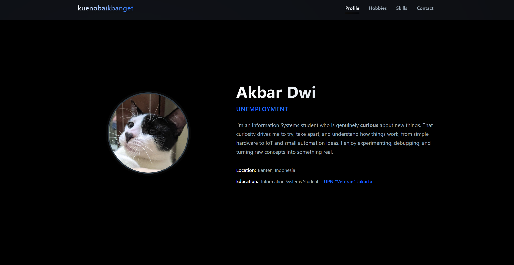

<div align="center">
  <h1>kuenobaikbanget's Portfolio</h1>
  
  <p><b>Personal portfolio website</b></p>
</div>

---

## ✨ About

This is my personal portfolio site. Here you can find:

- My profile and education
- Hobbies and interests
- Skills (C, HTML, CSS, Git, MySQL)
- Social media links
- Built with a minimalist dark theme, blue accent, and fully responsive layout

## 🚀 Getting Started

1. **Install dependencies:**
   ```powershell
   npm install
   ```
2. **Run locally:**
   ```powershell
   npm run dev
   ```
3. **Build for production:**
   ```powershell
   npm run build
   ```

## 📸 Preview



## 🙋‍♂️ Author

- **kuenobaikbanget**
- [GitHub](https://github.com/kuenobaikbanget)
- [Instagram](https://instagram.com/kuenobaikbanget)